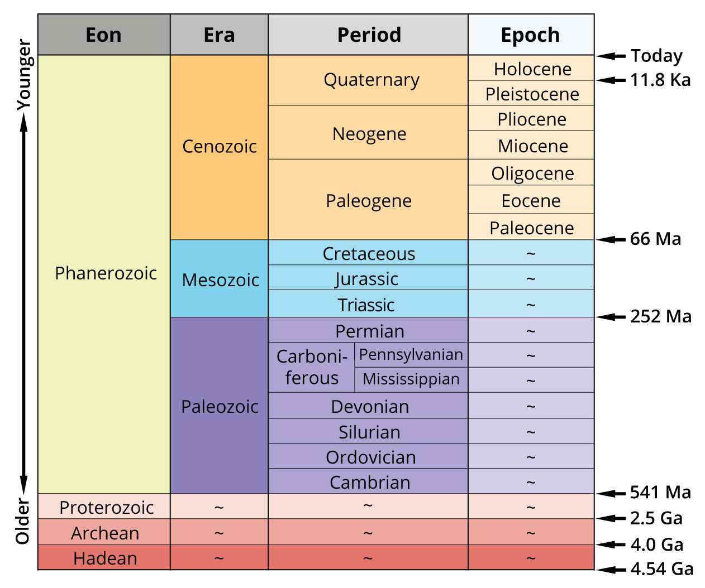

# Geological Time Scale

A useful time scale often used in geology, paleontology and to describe the evolution of species of millions of years.

Boundaries on the time scale match up with when a particular type of fossil came into origination or went extinct. Because of this, it is easy to assign a fossil to a specific geological time period.

Divided into 4 components:
1. eons
2. eras
3. periods
4. epochs

