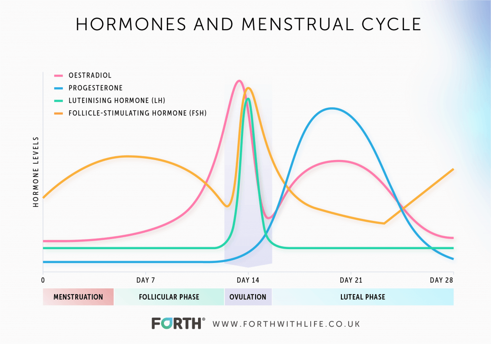

# Hormonal Control of Menstrual Cycle

[Follicle-stimulating Hormone (FSH)](Follicle-stimulating%20Hormone%20(FSH).md) and [Luteinising Hormone](Luteinising%20Hormone.md) both stimulate ovulation. FSH is secreted in greatest amounts in the first half of the menstrual cycle and LH is secreted at around the midpoint of the menstrual cycle. This causes ovulation to occur at around this time (aprox 14 days before next start of next menstrual cycle).

FSH causes estrogen levels to rise, which in turn regulates the production of FSH by the [pituitary gland](Pituitary%20Gland.md) creating a negative feedback loop. 
LH causes progesterone levels to rise after ovulation, which also creates a negative feedback loop, reducing the secretion of LH by the [pituitary gland](Pituitary%20Gland.md).

Note that oestradiol is a type of estrogen.

# References
1. 

---
tags: #untagged