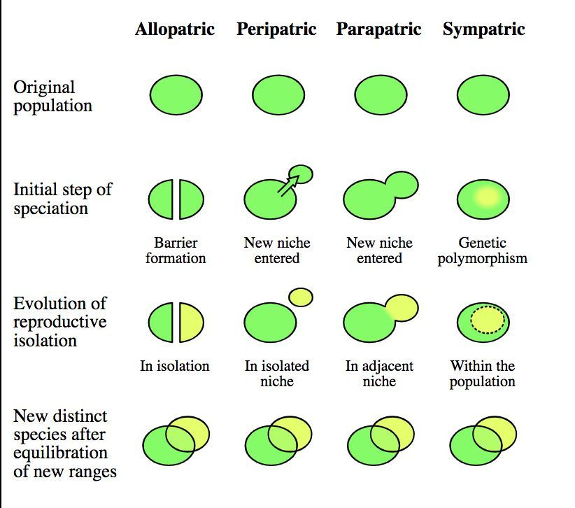

# Types of Speciation

Four major variants of speciation:
1. [Allopatric Speciation](Allopatric%20Speciation.md)
2. [Peripatric Speciation](Peripatric%20Speciation.md)
3. [Parapatric Speciation](Parapatric%20Speciation.md)
4. [Sympatric Speciation](Sympatric%20Speciation.md)

Note that these are all types of [Cladogenesis](Cladogenesis.md). Also see [Anagenesis](Anagenesis.md)

# References
1. 

---
tags: #untagged #todo